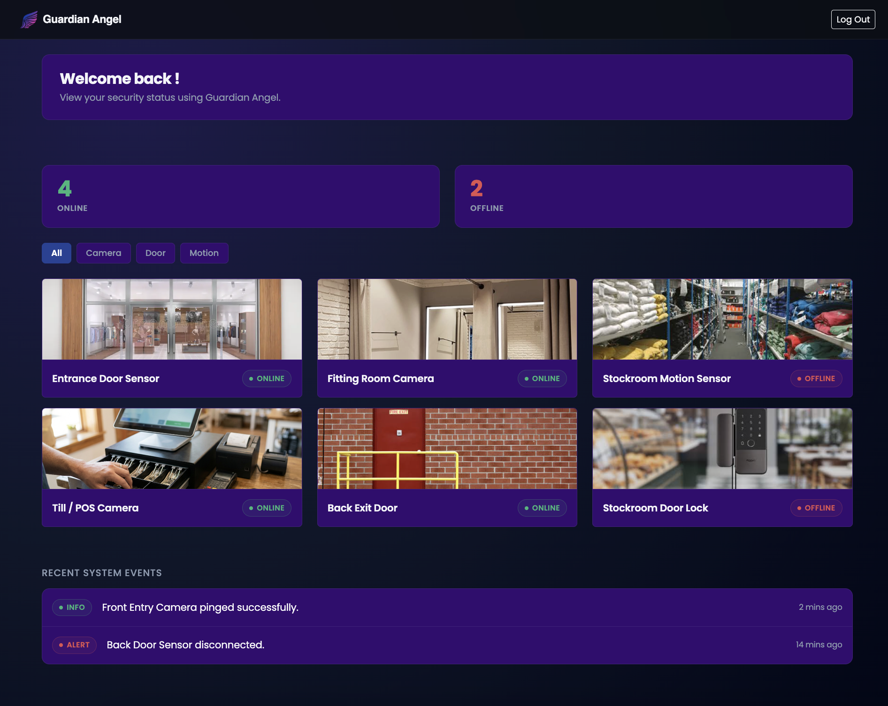

# Guardian Angel Security Dashboard

## A modern and easy to use security dashboard, overlooking and protecting your store. Just like a guardian Angel!

## Features

- **Global Authentication Flow:** Centralized state management using `AuthContext` to protect routes and handle session authorization.
- **Route Protection:** Custom `RequireAuth` component that guards restricted routes (e.g., `/dashboard`) and redirects unauthenticated users to `/login`.
- **Dynamic Hardware Filtering:** Instant client-side filtering by device type (`camera`, `door`, `motion`) driven by React `useState`.

---

## Tech Stack

- **Frontend Framework:** React (Vite / Create React App)
- **Routing:** React Router (`react-router-dom`)
- **Styling:** CSS Custom Properties (Variables) & Google Fonts

---

## Live Demo

